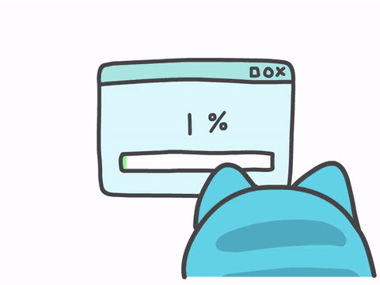

<!--**vivavv/vivavv** -->

## Hi there  I'm Viviana!

<br/>
<!-- Buttons -->
<a href="https://www.linkedin.com/in/vivianavrc/">
  
</a>
<a href="mailto:vivianavrc27@gmail.com">
 
</a>
<a href="https://t.me/vivavv">
 
</a>
<a href="https://open.spotify.com/user/vivavv">
 
</a>
</span>


<br />
<span>
Hello! I'm a Web Developer, I work mostly with Front-end and UX/UI Design👾 <br/> I speak Spanish, English, and French (basic)!🌎
</span>

<!-- Description -->

### About me:


- 👩🏻‍💻 I’m currently working with React + TypeScript + GraphQL!
- 🚀 Next goal is to do some back-end development
- 🔎 I want to learn more about mobile development
- ⭐️ I really love all things colorful!
- 🎶 I like to dance, exercise, listen to music and go to concerts in my free time :)
- 💬 You can ask me about anything

<br />
<!-- Languages and Tools -->

### Languages and Tools:

<br />
<code></code>
<code></code>
<code></code>
<code></code>
<code></code>
<code></code>
<code></code>
<code></code>
<code></code>
<br />
<code></code>
<code></code>
<code></code>
<code></code>
<code></code>
<br />
<code></code>
<code></code>
<code></code>
<code></code>
<code></code>
<br />


<br />
<br />

<!-- Stats -->

<!-- ### My GitHub Stats:



[](https://github.com/anuraghazra/github-readme-stats)

<br /> -->

### Weekly Stats:

<!--START_SECTION:waka-->


**I'm an Early 🐤** 

```text
🌞 Morning                167 commits         ███████████░░░░░░░░░░░░░░   45.63 % 
🌆 Daytime                124 commits         ████████░░░░░░░░░░░░░░░░░   33.88 % 
🌃 Evening                62 commits          ████░░░░░░░░░░░░░░░░░░░░░   16.94 % 
🌙 Night                  13 commits          █░░░░░░░░░░░░░░░░░░░░░░░░   03.55 % 
```


📊 **This Week I Spent My Time On** 

```text
🕑︎ Time Zone: America/Mexico_City

💬 Programming Languages: 
Svelte                   11 hrs 9 mins       ███████████████░░░░░░░░░░   61.15 % 
JavaScript               4 hrs 38 mins       ██████░░░░░░░░░░░░░░░░░░░   25.44 % 
Dart                     1 hr 50 mins        ███░░░░░░░░░░░░░░░░░░░░░░   10.09 % 
YAML                     19 mins             ░░░░░░░░░░░░░░░░░░░░░░░░░   01.78 % 
PHP                      6 mins              ░░░░░░░░░░░░░░░░░░░░░░░░░   00.57 % 

💻 Operating System: 
Mac                      18 hrs 14 mins      █████████████████████████   100.00 % 
```


 Last Updated on 17/08/2025 01:16:11 UTC
<!--END_SECTION:waka-->

<br />
<p align="center">
  
</p>

### Current Work:

📣 If you wanna know more about my current work, you can contact me :)
